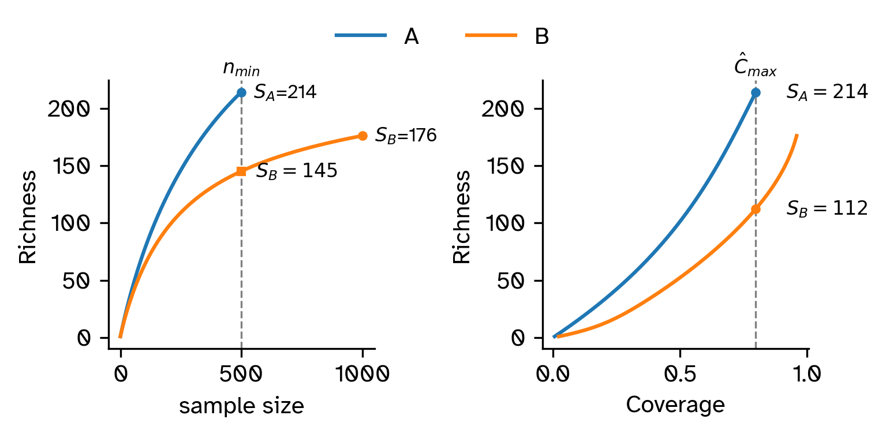

# Coverage-Based Standardization for Cultural Data: Correcting Collection Bias in Comparative Research

> Folgert Karsdorp, Anne Kandler, Mike Kestemont, Iza Romanowska, and Rombert Stapel

Code and data accompanying the paper "Coverage-Based Standardization for Cultural Data: Correcting Collection Bias in Comparative Research". Below we describe the main purpose of each file and link them to the images in the manuscript. 

# File structure
## Notebooks
- Figure 1: [example-figure.ipynb](notebooks/example-figure.ipynb)
- Main simulation experiments (Figures 2, 3, 4, 5, S1, S6): [simulation.ipynb](notebooks/simulation.ipynb)
- Coverage threshold analysis (Figure S5): [coverage_threshold.ipynb](notebooks/coverage_threshold.ipynb)
- Population size regression analysis (Figure 6): [song-coverage.ipynb](notebooks/song-coverage.ipynb)
- Diachronic regression analysis (Figure 7): [song-coverage-diachronic.ipynb](notebooks/song-coverage-diachronic.ipynb)
- Coverage accuracy analysis (Figures S2, S3, S4), [coverage_accuracy.ipynb](notebooks/coverage_accuracy.ipynb)
- Construct Amsterdam song data: [make-data-amsterdam.ipynb](notebooks/make-data-amsterdam.ipynb)
- Construct song data: [make-data-17th-century.ipynb](notebooks/make-data-17th-century.ipynb)

## Supporting Source Code
- Implementation of collection biases: [simulation.py](src/simulation.py)
- Wright-Fisher model implementation: [model.py](src/model.py)
- Main experiment functions: [experiment.py](src/experiment.py)
- Make data for coverage accuracy and ratio accuracy analysis: [coverage_threshold.py](src/coverage_threshold.py)
- Some utility functions: [utils.py](src/utils.py)

## Data (empirical and generated)
- Dutch Song Database melody locations counts: [dsd-melody-place-counts-census.csv](data/dsd-melody-place-counts-census.csv)
- Stratified sampling data: [exp_stratified-new.pkl](data/exp_stratified-new.pkl)
- Productivity paradox sampling data: [exp_productivity-new.pkl](data/exp_productivity-new.pkl)
- Stromer's Riddle paradox sampling data: [exp_stromer-new.pkl](data/exp_stromer-new.pkl)
- Wright-Fisher populations: [populations_list.pkl](data/populations_list.pkl)
- True diversity numbers from Wright-Fisher populations: [data/S_true.npy](data/S_true.npy)
- Population diversity comparisons:
    - [threshold_populations1-3.pkl](data/threshold_populations1-3.pkl)
    - [threshold_populations1-4.pkl](data/threshold_populations1-4.pkl)
    - [threshold_populations1-2.pkl](data/threshold_populations1-2.pkl)
- Census data: [population-estimates.csv](data/population-estimates.csv)
- Dutch Song Database melody counts Amsterdam: [dsd-amsterdam-melody-decade-counts.csv](data/dsd-amsterdam-melody-decade-counts.csv)
- Standardized Dutch place names: [placenames.json](data/placenames.json)

# Installation
1. `curl -LsSf https://astral.sh/uv/install.sh | sh`
2. navigate to project directory
3. `uv sync`
4. `cd notebooks`
5. `uv run jupyter notebook simulation.ipynb`
